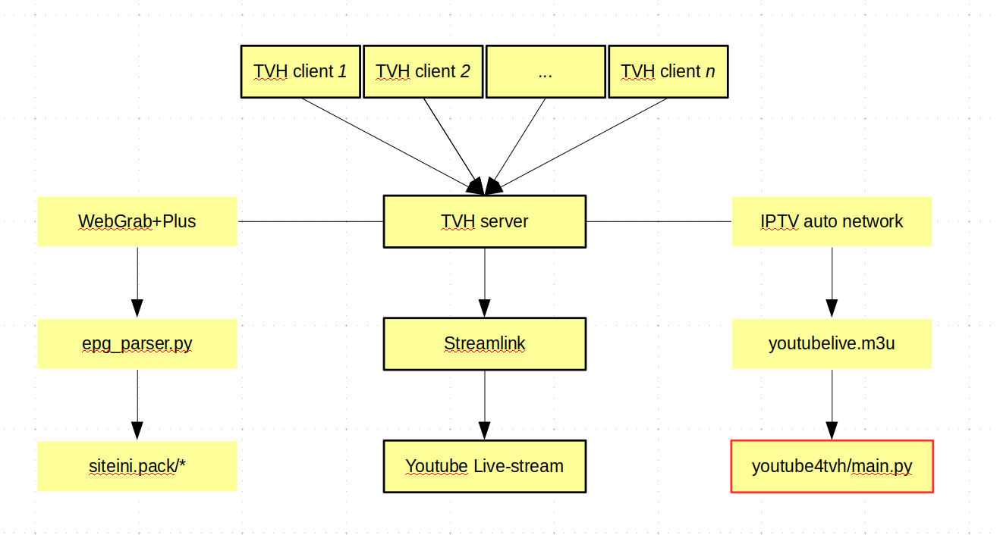

# Youtube 4 TVH
Youtube 4 TVH is a non-interactive CLI Python program that uses Youtube API to 
find live-streams and create (or update) m3u playlists with them. The m3u file 
follows IPTV conventions that allow a TVHeadend server to create an IPTV network 
with them, and each stream is piped into TVHeadend via a Streamlink 
(https://streamlink.github.io/) shell script.

# TVH layout



# Requirements
Python

Python packages: Pandas (pandas), RegEx (re), and Requests (requests)

Youtube API key (https://developers.google.com/youtube/v3/getting-started)

# Status
```diff
- Maintained by: cgomesu
- Working. Last checked on: April 23rd 2020.
```

# Installation
```diff
- Pending
```

# Usage
```diff
- Pending
```

# Examples
```diff
- Pending
```