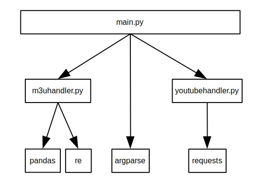

# Youtube 4 tvh
Youtube4tvh is a Python CLI program that uses Youtube API to find live-streams and create (or update) m3u playlists for a TVHeadend server (TVH; https://github.com/tvheadend/tvheadend). The m3u file follows IPTV conventions that allow a TVH server to automatically create an IPTV network with them, and each stream is piped into TVH via a Streamlink (https://streamlink.github.io/) shell script.

This utility is part of a guide I wrote on how to create an IPTV network in a TVH server composed entirely of Youtube live-streams.  You can read about it here: https://cgomesu.blogspot.com/2020/05/youtube-live-streams-as-iptv-channels.html


# Status
```diff
- Working
- Last checked on: May 5th 2020
```


# Modular structure




# Requirements
- Python 2.7 or higher

- Python packages: Pandas (pandas) and Requests (requests) is all you will need to install (see requirements.txt)

- A valid Youtube API key (https://developers.google.com/youtube/v3/getting-started). Be mindful of your request quota daily limits. You can check your API activity at https://console.cloud.google.com/apis/dashboard and will get a "quotaExceeded" msg when you've reached yours. API quotas are applied per project and you can create multiple projects, if necessary.

- A TVH server to feed the list to clients as an IPTV network

- Streamlink to pipe the stream data into a TVH server


# Suggested TVH client-server layout
In general, this program is well suited for a TVH server that has the following layout:


That is, there's one or more client that accesses a single TVH server that reads an m3u playlist (output.m3u) that contains one or more muxes from Youtube live-streams. Such a playlist is generated and managed by the current Python program (youtube4tvh/main.py) and the live-streams are piped into the TVH server via Streamlink. 


# Use-case
This program was created with the intention to be used with a TVH server. However, it's definitely possible to use it to simply create m3u playlists for other use cases. If you have a player that can read m3u files, you might want to change the --pipecmd to whatever command the player will accept to read the live-stream. 


# Installation
- Linux
```diff
# Open a terminal window
apt-get update
apt-get install git python-pip
cd /opt
git clone https://github.com/cgomesu/youtube4tvh.git
cd youtube4tvh
# Install required packages via pip
pip install .
# Test the program
cd youtube4tvh
python main.py --apikey=YOURKEY --channelname="DW News"
# Now, there should be an output.m3u playlist on the same folder with the DW News channel live-stream.
# If you run into permission issues, then 'sudo chown -R YOURUSER:sudo /opt/youtube4tvh', changing YOURSER for your sudo username.
# If TVH is unable to run streamlink.sh, try 'sudo chmod 0777 /opt/youtube4tvh/streamlink.sh'.
```

- Mac
```diff
- Pending
```

- Windows
```diff
- Pending
```


# Usage
```diff
usage: main.py [-h] --apikey APIKEY [--apiurl APIURL] [--channelid CHANNELID]
               [--channellogo CHANNELLOGO] [--channelname CHANNELNAME]
               [--m3uinput M3UINPUT] [--m3uoutput M3UOUTPUT]
               [--mode {add,update}] [--pipecmd PIPECMD]

optional arguments:
  -h, --help            show this help message and exit
  --apikey APIKEY       your API KEY to use the Youtube API. see
                        https://developers.google.com/youtube/v3/getting-
                        started.
  --apiurl APIURL       base URL of the Youtube API. default uses the Youtube
                        API v3.
  --channelid CHANNELID
                        for --mode=add. the ID of a channel with a live-
                        stream. if not provided, obtained from a channel name
                        query.
  --channellogo CHANNELLOGO
                        for --mode=add. the URL of the channel's LOGO. if the
                        channel id is not provided, it will be obtained from a
                        channel name query.
  --channelname CHANNELNAME
                        REQUIRED for --mode=add. the NAME of the channel with
                        a live-stream.
  --m3uinput M3UINPUT   REQUIRED for --mode=update. the /path/to/input.m3u.
                        used to import data from an existing m3u file.
  --m3uoutput M3UOUTPUT
                        the /path/to/output.m3u. default is output.m3u.
  --mode {add,update}   mode of execution. choose add or update. mode=add will
                        add a single channel to an m3u file (default).
                        mode=update will update the URL of multiple channels
                        from an m3u file.
  --pipecmd PIPECMD     the command to pipe data to a player/server. for TVH
                        and streamlink, it is pipe:///path/to/bash
                        /path/to/streamlink.sh, for example. default is
                        "pipe:///bin/bash /opt/youtube4tvh/streamlink.sh".
```


# Examples
- Create a new youtube.m3u playlist with the live-stream from "France 24 English":
```diff
python main.py --apikey=YOURKEY --m3uoutput=youtube.m3u --channelname="France 24 English"

# Output:
[INFO] Retrieving channel info using the NAME provided...
The channel ID is: UCQfwfsi5VrQ8yKZ-UWmAEFg
The URL of the channel's logo is: https://yt3.ggpht.com/-Qc-MGBq90YE/AAAAAAAAAAI/AAAAAAAAAAA/AAmrwHX7No0/s88-c-k-no-mo-rj-c0xffffff/photo.jpg
[INFO] Retrieving info from the channel's live-stream...
A live-stream was found!  Extracting info from it...
Done extracting info from the live-stream!
[INFO] Did not find an input M3U playlist.  Generating an empty data frame...
Empty data frame created.
[INFO] Appending stream info to data frame...
[INFO] Writing data frame to .m3u file...
Data frame was successfully exported to youtube.m3u!
[INFO] Done!
[INFO] We're all done here. Bye!
```
```diff
cat youtube.m3u

# Output:
#EXTM3U
#EXTINF:-1 tvg-id="UCQfwfsi5VrQ8yKZ-UWmAEFg" tvg-name="France 24 English" tvg-language="" tvg-country="BR" tvg-logo="https://yt3.ggpht.com/-Qc-MGBq90YE/AAAAAAAAAAI/AAAAAAAAAAA/AAmrwHX7No0/s88-c-k-no-mo-rj-c0xffffff/photo.jpg" tvg-url="" group-title="",France 24 English
pipe:///bin/bash /opt/youtube4tvh/streamlink.sh https://www.youtube.com/watch?v=BJzSJlMwQcA
```

- Append the live-stream from "ABC News AU" to youtube.m3u:
```diff
python main.py --apikey=YOURKEY --m3uinput=youtube.m3u --m3uoutput=youtube.m3u --channelname="ABC News AU"

# Output:
[INFO] Retrieving channel info using the NAME provided...
The channel ID is: UCVgO39Bk5sMo66-6o6Spn6Q
The URL of the channel's logo is: https://yt3.ggpht.com/-Eh3AwGhwPeI/AAAAAAAAAAI/AAAAAAAAAAA/QomvTf2lg_s/s88-c-k-no-mo-rj-c0xffffff/photo.jpg
[INFO] Retrieving info from the channel's live-stream...
A live-stream was found!  Extracting info from it...
Done extracting info from the live-stream!
[INFO] User provided an input M3U playlist at youtube.m3u.  Will try to parse it and create a data frame...
Validating the m3u file...
Did not find bad headers in the m3u file youtube.m3u.
Parsing the m3u file...
The m3u file was successfully parsed!
[INFO] Did not find the same channel on youtube.m3u. Will append the channel info to data frame...
[INFO] Writing data frame to .m3u file...
Data frame was successfully exported to youtube.m3u!
[INFO] Done!
[INFO] We're all done here. Bye!
```
```diff
cat youtube.m3u

# Output:
#EXTM3U
#EXTINF:-1 tvg-id="UCQfwfsi5VrQ8yKZ-UWmAEFg" tvg-name="France 24 English" tvg-language="" tvg-country="BR" tvg-logo="https://yt3.ggpht.com/-Qc-MGBq90YE/AAAAAAAAAAI/AAAAAAAAAAA/AAmrwHX7No0/s88-c-k-no-mo-rj-c0xffffff/photo.jpg" tvg-url="" group-title="",France 24 English
pipe:///bin/bash /opt/youtube4tvh/streamlink.sh https://www.youtube.com/watch?v=BJzSJlMwQcA
#EXTINF:-1 tvg-id="UCVgO39Bk5sMo66-6o6Spn6Q" tvg-name="ABC News AU" tvg-language="" tvg-country="BR" tvg-logo="https://yt3.ggpht.com/-Eh3AwGhwPeI/AAAAAAAAAAI/AAAAAAAAAAA/QomvTf2lg_s/s88-c-k-no-mo-rj-c0xffffff/photo.jpg" tvg-url="" group-title="",ABC News AU
pipe:///bin/bash /opt/youtube4tvh/streamlink.sh https://www.youtube.com/watch?v=pES1Zd_vyjU
```

- Update all URLS from the youtube.m3u
```diff
python main.py --apikey=YOURKEY --m3uinput=youtube.m3u --m3uoutput=youtube.m3u --mode=update

# Output:
[INFO] User provided an input M3U playlist at youtube.m3u.  Will try to parse it and create a data frame...
Validating the m3u file...
Did not find bad headers in the m3u file youtube.m3u.
Parsing the m3u file...
The m3u file was successfully parsed!
[INFO] Updating channel: France 24 English...
[INFO] Retrieving channel info using the NAME provided...
The channel ID is: UCQfwfsi5VrQ8yKZ-UWmAEFg
The URL of the channel's logo is: https://yt3.ggpht.com/-Qc-MGBq90YE/AAAAAAAAAAI/AAAAAAAAAAA/AAmrwHX7No0/s88-c-k-no-mo-rj-c0xffffff/photo.jpg
[INFO] Retrieving info from the channel's live-stream...
A live-stream was found!  Extracting info from it...
Done extracting info from the live-stream!
[INFO] User provided an input M3U playlist at youtube.m3u.  Will try to parse it and create a data frame...
Validating the m3u file...
Did not find bad headers in the m3u file youtube.m3u.
Parsing the m3u file...
The m3u file was successfully parsed!
[INFO] Found the same channel on youtube.m3u. Updating its url in the data frame...
[INFO] Writing data frame to .m3u file...
Data frame was successfully exported to youtube.m3u!
[INFO] Done!
[INFO] Updating channel: ABC News AU...
[INFO] Retrieving channel info using the NAME provided...
The channel ID is: UCVgO39Bk5sMo66-6o6Spn6Q
The URL of the channel's logo is: https://yt3.ggpht.com/-Eh3AwGhwPeI/AAAAAAAAAAI/AAAAAAAAAAA/QomvTf2lg_s/s88-c-k-no-mo-rj-c0xffffff/photo.jpg
[INFO] Retrieving info from the channel's live-stream...
A live-stream was found!  Extracting info from it...
Done extracting info from the live-stream!
[INFO] User provided an input M3U playlist at youtube.m3u.  Will try to parse it and create a data frame...
Validating the m3u file...
Did not find bad headers in the m3u file youtube.m3u.
Parsing the m3u file...
The m3u file was successfully parsed!
[INFO] Found the same channel on youtube.m3u. Updating its url in the data frame...
[INFO] Writing data frame to .m3u file...
Data frame was successfully exported to youtube.m3u!
[INFO] Done!
[INFO] We're all done here. Bye!

```

- Update all URLS from the /path/to/youtube.m3u everyday at 6am via a cronjob:
```diff
crontab -e
# Go to the end of the file and add the following,
# changing /path/to to your absolute path:
0 6 * * * /path/to/python /path/to/main.py --apikey=YOURKEY --m3uinput=/path/to/youtube.m3u --m3uoutput=/path/to/youtube.m3u --mode=update
# Save and exit (ctrl+x)
```
